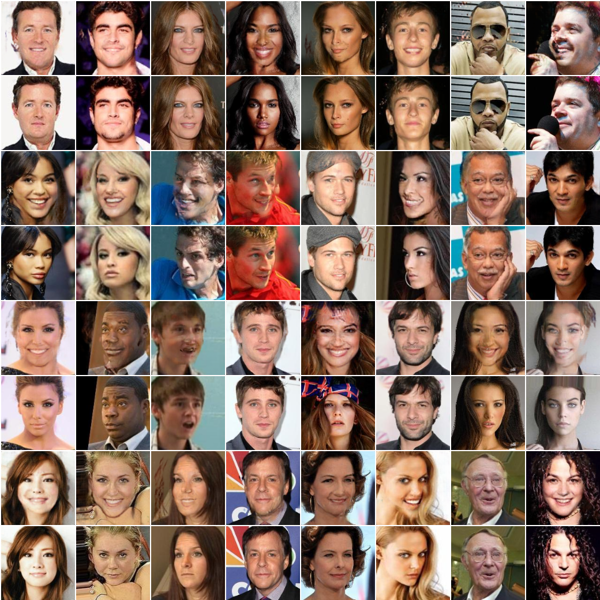

# Masking GAN - Generating image attribute mask (pytorch)

## Motivation
Quick search through recent papers on image editing: 
1. [Invertible Conditional GANs for image editing](https://arxiv.org/abs/1611.06355)
2. [Neural Photo Editing with Introspective Adversarial Networks](https://arxiv.org/abs/1609.07093)
3. [Face Aging With Conditional Generative Adversarial Networks](https://arxiv.org/abs/1702.01983)

shows that they all are based on building image reconstruction and manipulating latent variables. Unfortunately it leads to unwanted changes, e.g. in background. In [2] authors try to preserve personality and other details by adding difference between original image and initial reconstruction. In this work I study another approch which is to learn a sparse mask needed to change image attribute.

## Approach
In this work I studing only a single case of adding smile to face images berause of limited computational power and time resources.
I use [EBGAN](https://arxiv.org/abs/1609.03126) architecture to train the model.
1. Split CelebA dataset into two subsets (**D<sub>smile</sub>** and **D<sub>normal</sub>** with and without "smiling" attribute respectivetly).
2. Use **D<sub>smile</sub>** as real examples for Descriminator, **and D<sub>normal</sub>** for conditioning Generator.
3. Add L1 distance loss between generated and real images.
4. Balance L1 and EBGAN loss (tune margin) until you get suitable result.


## Instructions
I am using CelebA dataset to train the model. There are two files you would need if you want to reproduce results: *img\_align\_celeba.zip* and *list\_attr\_celeba.txt*

You can download them from here http://mmlab.ie.cuhk.edu.hk/projects/CelebA.html and put into {PROJECT\_DIR}/data  
After that initialize data and train the model by running
```bash
sh init_data.sh
python train.py
```

## Results


Unfortunately the results are not consistent

## Advices
Consider following advices if you want to build this kind of model:
1. Make sure your GAN model converges without appling mask and L1 loss.
2. Try larger model if you have available resources.

